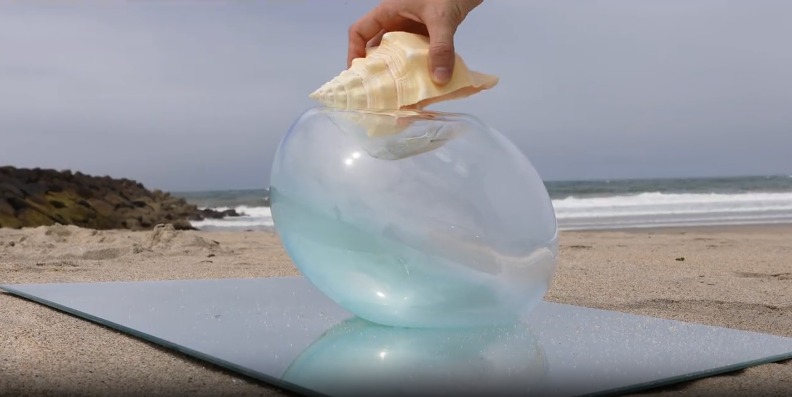
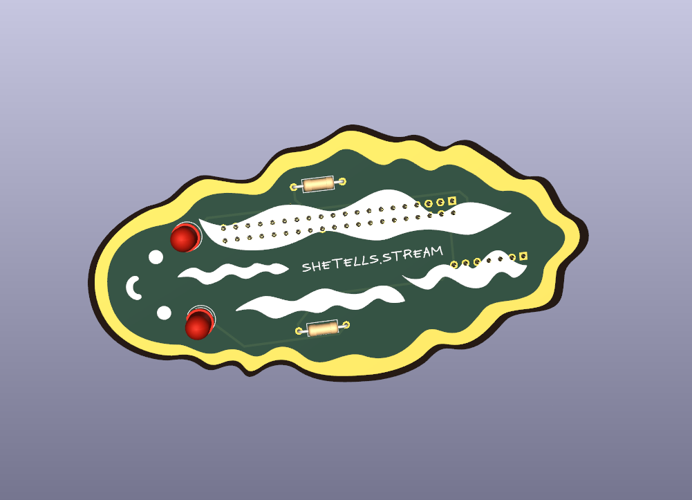
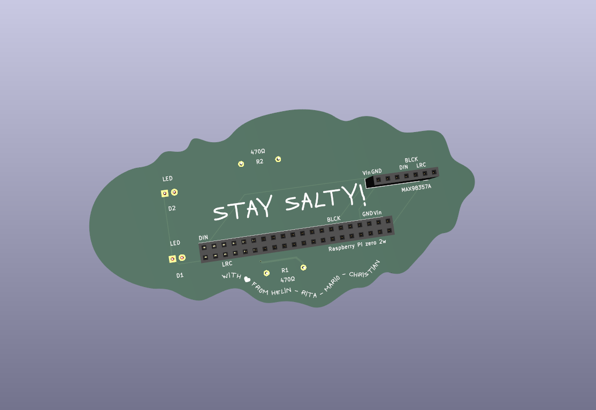

# 🐚 DIY Shellphone

This repository is the open-source reference for the *DYI Shell Phone*, so anyone can build their own, part of **[She Tells, Sea Shells](https://shetells.stream/)**, an artistic research project, developing both an artwork, an installation of the Shetells artwork, and a toolkit. 

The project emerges from the simple, almost childlike gesture of holding a shell to the ear, hearing the ocean’s presence. This toolkit is conceived as a means for the waters of Esposende to exchange with their inhabitants, enabling acts of observation, remembrance, and speculation about the futures of water bodies. Through this, a playful voice is extended to the non-human presences and aquatic landscapes of the ecosystem.

> **Status: work in progress.** The electronics (the custom audio board) are designed and documented here, and the 3D-printable shell is included. Step-by-step assembly guide with photos is being added.

---

## About the project

**English** - The Shellphone is a shell you can listen to. Inside a 3D-printed shell sits a Raspberry Pi Zero 2 W and a small custom audio board. When you hold the shell to your ear, it connects over WiFi to [shetells.stream](https://shetells.stream/) and plays its live **[stream](https://shetells.stream/stream.html)** - a flow of voices and memories that people have shared about water: the sea, rivers, drought, the things we are losing. It turns a familiar gesture - listening to a shell - into a way of listening to each other, and to the water. *(You can also explore the [Living Archive](https://shetells.stream/living-archive.html) to see the memories and the process behind the piece.)*

**Português** - O Shellphone é uma concha que se pode escutar. Dentro de uma concha impressa em 3D estão uma Raspberry Pi Zero 2 W e uma pequena placa de áudio feita à medida. Ao aproximar a concha do ouvido, liga-se por WiFi a [shetells.stream](https://shetells.stream/) e reproduz a sua **[transmissão ao vivo](https://shetells.stream/stream.html)** — um fluxo de vozes e memórias que as pessoas partilharam sobre a água: o mar, os rios, a seca, aquilo que estamos a perder. Transforma um gesto familiar - ouvir uma concha - numa forma de nos ouvirmos uns aos outros, e de ouvir a água. *(Também podes explorar o [Arquivo Vivo](https://shetells.stream/living-archive.html) para ver as memórias e o processo por detrás da peça.)*

---

## How it works

The Shellphone is three parts, hidden inside a shell:

1. **Raspberry Pi Zero 2 W** - a tiny WiFi computer. It connects to the internet and plays the live [stream](https://shetells.stream/stream.html) from [shetells.stream](https://shetells.stream/).
2. **Custom audio board** - a small PCB that plugs onto the Pi like a "HAT". It carries a **MAX98357A I2S amplifier** that turns the Pi's digital audio into a real signal, plus two LED "eyes". The board is shaped like a snail.
3. **Bone-conduction transducer** (8 Ω, 1 W) - instead of a normal speaker, a small transducer that makes whatever it touches vibrate. Mounted against the shell, it turns *the shell itself* into the speaker, so the sound seems to rise out of the shell in your hand.

Everything is powered over USB (5 V).

  
  

The audio board connects to the Pi's audio pins like this:

| Amp signal | Raspberry Pi pin |
|---|---|
| Audio clock (BCLK) | GPIO18 (pin 12) |
| Word select (LRC) | GPIO19 (pin 35) |
| Audio data (DIN) | GPIO21 (pin 40) |
| Power (Vin) | 5V (pin 2) |
| Ground (GND) | GND (pin 6) |

*(Full board design: [`hardware/pcb/`](hardware/pcb/), a KiCad project.)*

---

## What's in this repo

| Folder / file | What's inside | Status |
|---|---|---|
| [`hardware/pcb/`](hardware/pcb/) | KiCad design files for the audio board | ✅ Designed |
| [`hardware/bom.md`](hardware/bom.md) | Bill of Materials - the full parts list | ✅ |
| [`enclosure/`](enclosure/) | 3D-printable shell (`.3mf`, `.obj`) | ✅ Included |
| [`images/`](images/) | Photos and board renders | ✅ |
| **Software** | Lives in a **separate repository** (not hosted here) | 🚧 Link coming |
| [`docs/`](docs/) | Assembly guide + build photos | 🚧 Coming |

---

## Build your own

1. **Get the parts** - see the [Bill of Materials](hardware/bom.md).
2. **Make the audio board** - open the KiCad project in [`hardware/pcb/`](hardware/pcb/), export the Gerber files, and send them to any PCB fab (e.g. JLCPCB, PCBWay).
3. **Print the shell** - print the model in [`enclosure/`](enclosure/).
4. **Set up the Raspberry Pi** - flash the SD card and install the streaming software from the [software repository](#software).
5. **Assemble** - solder the board, plug it onto the Pi, attach the bone-conduction transducer to the shell, and fit it all inside. 🚧 *Illustrated guide coming in `docs/`.*

---

## Software

The Raspberry Pi software (connecting to WiFi and playing the stream) lives in its own repository: 🚧 **[link coming soon]**

---

## Credits

Made by:

- **Helin Ulaş** - [helinulas.info](https://helinulas.info/)
- **Rita Eperjesi** - [rita.cloud](https://rita.cloud/)
- **Mario Guzman** - [mario-guzman.com](https://www.mario-guzman.com/)
- **Christian Kokott** - [kokott.art](https://kokott.art/)

Developed as part of the S+T+ARTS Aquamotion artist residency ( co- funded by the European Union), residency hosted by Rio Neiva.

🌐 [shetells.stream](https://shetells.stream/) · 🔊 [Live stream](https://shetells.stream/stream.html) · 📚 [Living Archive](https://shetells.stream/living-archive.html)

<!-- 🚧 TODO: EU-funded acknowledgment line + logo. -->

